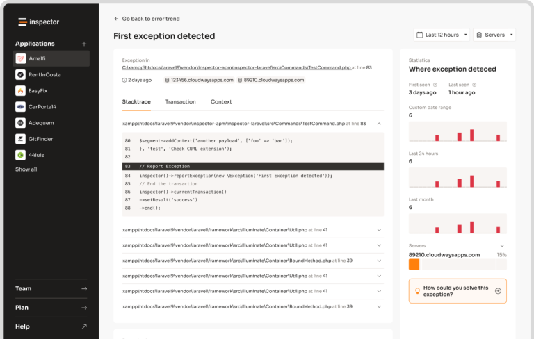

# AIForm - Conversational Data Collection

AIForm is a component for collecting structured data through multi-turn natural language conversations. It uses an AI agent to progressively gather information defined by a structured output class, validating each piece of data along the way.

The form maintains conversation history, tracks collected fields, missing fields, and validation errors across multiple turns.

## Creating a Data Class

You can provide the form structure you want to collect defining a data class using PHP attributes in the same way as you would with any other
[structured output](https://docs.neuron-ai.dev/agent/structured-output) class in Neuron AI.

You can also attach validation rules like `#[NotBlank]` or `#[Email]` to fields, to enforce data requirements.

```php
use NeuronAI\StructuredOutput\SchemaProperty;
use NeuronAI\StructuredOutput\Validation\Rules\Email;
use NeuronAI\StructuredOutput\Validation\Rules\NotBlank;

class RegistrationData
{
    #[SchemaProperty(description: 'User full name', required: true)]
    #[NotBlank]
    public string $name;

    #[SchemaProperty(description: 'Email address', required: true)]
    #[Email]
    public string $email;

    #[SchemaProperty(description: 'Phone number')]
    public ?string $phone = null;

    #[SchemaProperty(description: 'Company name')]
    public ?string $company = null;
}
```

## Creating a Custom Form

Extend the `AIForm` class to create your custom form:

```php
<?php

namespace App\Neuron\Forms;

use NeuronAI\Form\AIForm;
use NeuronAI\Form\Enums\FormStatus;
use NeuronAI\Form\FormState;
use NeuronAI\Providers\Anthropic\Anthropic;

class RegistrationForm extends AIForm
{
    protected string $formDataClass = RegistrationData::class;

    protected function provider(): AIProviderInterface
    {
        return new Anthropic(
            key: 'ANTHROPIC_API_KEY',
            model: 'ANTHROPIC_MODEL',
        );
    }

    /**
     * Handle the submitted form data.
     */
    protected function callback(): mixed
    {
        // $data is an instance of RegistrationData
        // Save to database, send email, call API, etc.
        return function (RegistrationData $data) {
            $this->userService->register($data);
        };
    }
}
```

## Using Form in Application Code

### Basic Usage

```php
use App\Forms\RegistrationForm;
use NeuronAI\Chat\Messages\UserMessage;
use NeuronAI\Providers\OpenAI\OpenAI;

// Create form instance with AI provider
$form = RegistrationForm::make();

// Turn 1
$state = $form->process(new UserMessage("Hi, I'd like to register"));
$state = $handler->run();

echo $state->getStatus()->value;        // 'incomplete'
echo $handler->getLastResponse();        // AI asks for name

// Turn 2
$handler = $form->process(new UserMessage("My name is John Doe"));
$state = $handler->run();

// Turn 3
$handler = $form->process(new UserMessage("john@example.com"));
$state = $handler->run();

// Check progress
echo $state->getCompletionPercentage();  // e.g., 75
print_r($state->getMissingFields());     // ['phone', 'company']
```

### Web Application Example (Controller)

```php
use App\Forms\RegistrationForm;
use NeuronAI\Chat\History\FileChatHistory;
use NeuronAI\Chat\Messages\UserMessage;
use NeuronAI\Workflow\Persistence\FilePersistence;

class RegistrationController
{
    public function __invoke(Request $request): Response
    {
        $sessionId = $request->session()->getId();

        // Create form with persistence for multi-request handling
        $form = RegistrationForm::make()
            ->setChatHistory(new FileChatHistory("/tmp/chats/{$sessionId}"));

        // Send the next user message
        $handler = $form->process(
            new UserMessage($request->input('message'))
        );

        $state = $handler->run();

        return response()->json([
            'status' => $state->getStatus()->value,
            'message' => $handler->getLastResponse(),
            'completion' => $state->getCompletionPercentage(),
            'missing_fields' => $state->getMissingFields(),
            'is_complete' => $form->isComplete(),
        ]);
    }
}
```

## Requiring Confirmation

When you need users to review and confirm their data before submission, enable confirmation mode:

```php
class RegistrationForm extends AIForm
{
    protected string $formDataClass = RegistrationData::class;

    protected function provider(): AIProviderInterface
    {
        return new Anthropic('key', 'model');
    }
}

// Enable confirmation in your application code
$form = RegistrationForm::make()->requireConfirmation(true);
```

### How It Works

When confirmation is enabled and all required fields are collected, the form throws a `FormInterruptRequest` instead of submitting immediately.
This interrupts the workflow and gives you control over the confirmation flow:

```php
use NeuronAI\Form\Interrupt\FormInterruptRequest;

$handler = $form->process(new UserMessage("john@example.com"));
$state = $handler->run();

// Check if the form is waiting for confirmation
if ($handler->getInterrupt() instanceof FormInterruptRequest) {
    $interrupt = $handler->getInterrupt();

    // The interrupt contains the collected data for review
    $data = $interrupt->getData();

    // The AI-generated confirmation message
    echo $handler->getLastResponse();
    // "I've collected the following information:
    //  Name: John Doe
    //  Email: john@example.com
    //  Is this correct?"

    // Store the interrupt (e.g., in session) to resume later
    $_SESSION['form_interrupt'] = serialize($interrupt);
}
```

### Resuming After Confirmation

To resume the form after the user responds to the confirmation prompt, pass the interrupt back to `process()`:

```php
// Retrieve the stored interrupt
$interrupt = unserialize($_SESSION['form_interrupt']);

// User confirms the data
$handler = $form->process(new UserMessage("Yes, that's correct"), $interrupt);
$state = $handler->run();

echo $state->getStatus()->value;  // 'complete'

// If the user wants to make changes
$handler = $form->process(new UserMessage("No, I need to change my email"), $interrupt);
$state = $handler->run();

echo $state->getStatus()->value;  // 'incomplete' - back to collecting data
```

### Confirmation Phrases

The form recognizes these confirmation responses:

- **Confirm**: "yes", "confirm", "correct", "right", "ok", "okay", "sure", "yep", "yeah"
- **Reject**: "no", "cancel", "wrong", "incorrect", "change", "edit", "nope"

### Handling Cancellation

Users can cancel the form at any time using exit phrases:

```php
$handler = $form->process(new UserMessage("cancel"));
$state = $handler->run();

echo $state->getStatus()->value;  // 'closed'
```

### Accessing Form Data

```php
// Get collected data (available during collection)
$data = $form->getData();
// or
$data = $state->getCollectedData();

// Get submitted data (available after submission)
$submitted = $state->getSubmittedData();

// Get form state details
$missing = $state->getMissingFields();        // ['email', 'phone']
$errors = $state->getValidationErrors();      // ['name' => ['must not be blank']]
$completion = $state->getCompletionPercentage(); // 50
```

## Custom Exit Detection

Override `detectExit()` for custom cancellation logic:

```php
class SmartForm extends AIForm
{
    protected function detectExit(string $content): bool
    {
        // Add custom exit detection
        if (preg_match('/no\s+thanks|not\s+interested/i', $content)) {
            return true;
        }

        return parent::detectExit($content);
    }
}
```

## Monitoring

Since this component is build on top of Neuron AI Workflow, it natively supports monitoring and debugging using the
built-in [Inspector](https://inspector.dev) integration.

After you sign up, make sure to set the `INSPECTOR_INGESTION_KEY` variable in the application environment file to start monitoring:

```dotenv
INSPECTOR_INGESTION_KEY=fwe45gtxxxxxxxxxxxxxxxxxxxxxxxxxxxx
```

After configuring the environment variable, you will see the agent execution timeline in your Inspector dashboard.

[](https://inspector.dev)

Learn more about Monitoring in the [documentation](https://docs.neuron-ai.dev/agent/observability).

## Behind the scenes

This package is built on top of the Neuron AI Workflow component, just like the Agent class, but
designed toward a specific use case: collecting structured data from the user conversation.

- Neuron AI Workflow: https://docs.neuron-ai.dev/workflow/getting-started
- Neuron AI Agent: https://docs.neuron-ai.dev/agent/agent
- Neuron AI Structured Output: https://docs.neuron-ai.dev/agent/structured-output
